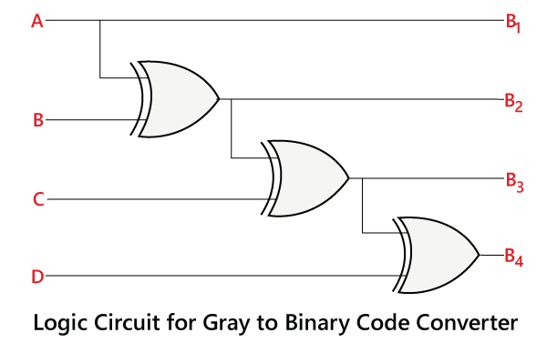
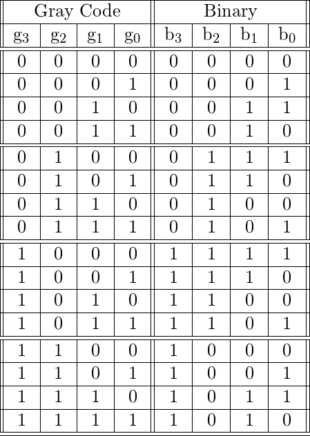
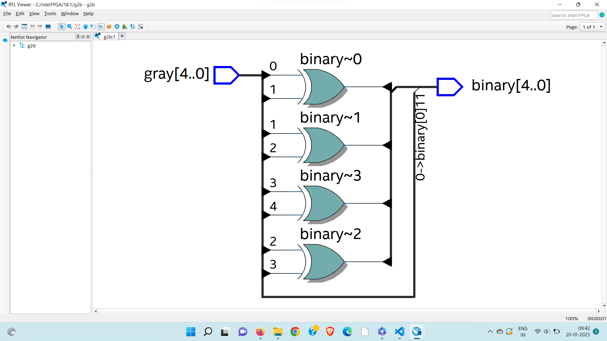
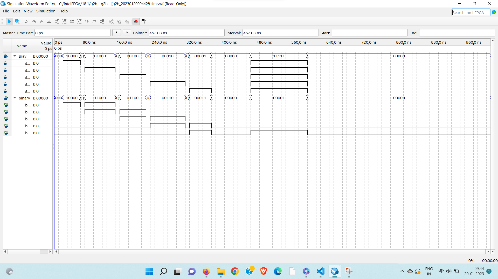

# 5bitgraytobinary

# AIM:
to write verilog code for gray to binary conversion

# Introduction:
Gray codes are used to encode ordered sequences of numbers, such that one number in the sequence differs from the next (or previous) by only one bit. It is not a positional code, i.e. no weight is assigned to the bits according to their position.

Given an ordered sequence of numbers, there is no unique coding of Gray's codes for them. A simple way to generate a Gray code sequence, starting from a binary number sequence, is described by the following algorithm:
they are

b = bₙ₋₁...b₀ and g = gₙ₋₁ ... g₀

the two input (an integer number expressed in binary coding) and output (the respective Gray's code) values, respectively;

copy the most significant bit of the input to the output:

gₙ₋₁ = bₙ₋₁

for each following bit gᵢ is calculated

gᵢ = bᵢ₊₁ ⊕ bᵢ.

# logic diagram:


## logical expression:
Boolean expression for conversion of gray to binary code for n-bit :

B n = G n

B n-1 = B n XOR G n-1 = G n XOR G n-1 : :

B 1 = B 2 XOR G 1 = G n XOR ………… XOR G 1

### truth table 
most common example of gray to binary is 4 bit
truth table 


## verilog program
```
module g2b (input [4:0] gray, output [4:0] binary);
   assign binary[0] = gray[0];
   assign binary[1] = gray[0] ^ gray[1];
   assign binary[2] = gray[1] ^ gray[2];
   assign binary[3] = gray[2] ^ gray[3];
   assign binary[4] = gray[3] ^ gray[4];
endmodule
```
# output:
## rtl diagram:
 5bit gray to binary:
 

## time diagram
5bit gray to binary:
 

# Result:
we obtained output binary from 5 bit gray using verilog code.

